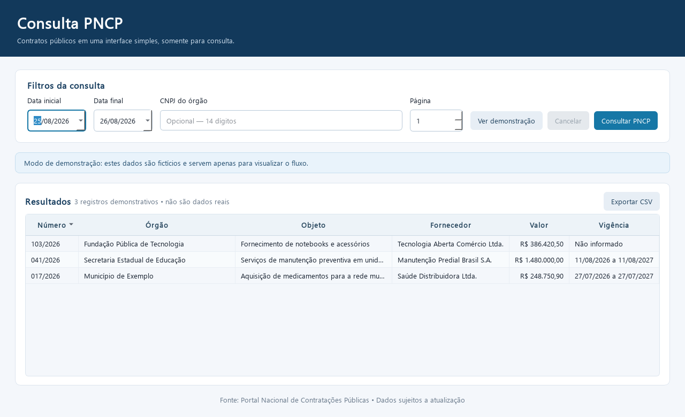

# Melhorias futuras

Esta pasta preserva ideias válidas que foram retiradas do foco atual. Elas não foram descartadas; apenas não devem competir agora com a construção do sincronizador e do banco local do PNCP.

## Material preservado

- [Interface desktop: arquitetura e desafios](INTERFACE_DESKTOP_ARQUITETURA_E_DESAFIOS.md) — desenho e dificuldades do protótipo gráfico já existente.
- [Prévia da interface](preview-interface.png) — captura do protótipo em modo de demonstração.
- [Consultas com sinergia ao PNCP](CONSULTAS_SINERGICAS_AO_PNCP.md) — levantamento de outras bases públicas que podem enriquecer o produto.
- [Bibliotecas e estrutura do ecossistema](BIBLIOTECAS_E_ESTRUTURA_DO_ECOSSISTEMA.md) — proposta de conectores separados para outras APIs governamentais.

## Regra para retomar uma ideia

Uma melhoria desta pasta só volta ao desenvolvimento ativo quando:

1. a fatia vertical do sincronizador estiver funcionando;
2. a carga puder ser interrompida e retomada;
3. uma reexecução não criar duplicatas;
4. as medições básicas de volume, tempo e erros existirem;
5. a nova ideia tiver um problema e um usuário claramente definidos.

Assim evitamos construir simultaneamente coletor, banco, várias bibliotecas e interface final antes de comprovar o núcleo do produto.

